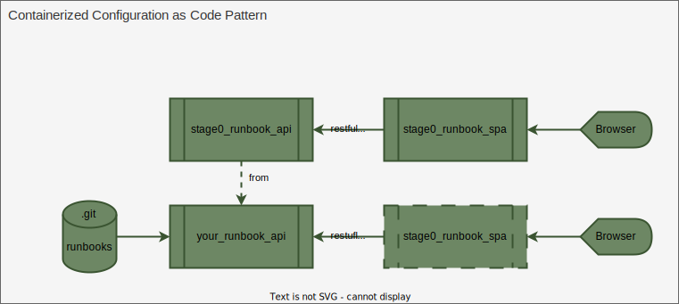

# Stage0 Runbook System - SRE Documentation

Technical documentation for Site Reliability Engineers deploying and customizing the Stage0 Runbook System.

## Table of Contents

- [Architecture Overview](#architecture-overview)
- [Customization and Deployment](#customization-and-deployment)
- [Security Configuration](#security-configuration)
- [Production Configuration](#production-configuration)
- [Observability](#observability)
- [Troubleshooting](#troubleshooting)

## Architecture Overview



The Stage0 Runbook System is a Containerized Configuration as Code application designed for small DevOps teams (~20 users) with sporadic usage patterns.

### Components

- **API Service**: Flask-based REST API for validating and executing runbooks
  - Base image: `ghcr.io/agile-learning-institute/stage0_runbook_api:latest`
  - Includes: Python 3.12, Flask, Gunicorn, Prometheus metrics endpoint
- **SPA Service**: Web UI for browsing and executing runbooks
  - Base image: `ghcr.io/agile-learning-institute/stage0_runbook_spa:latest`
  - Includes: Nginx, Vue.js application, API proxy configuration

### Deployment Model

The system supports two deployment modes (both use Docker Compose profiles):

1. **Development Mode** (`runbook-dev` profile): Mounts local runbooks directory for iterative development
2. **Deployment Mode** (`runbook-deploy` profile): Uses runbooks packaged in container image for immutable deployments

For deployment architecture details, see the [Template Repository](https://github.com/agile-learning-institute/stage0_runbook_template).

## Customization and Deployment

### Extending the Base Image

To add tools (AWS CLI, Terraform, Docker CLI, etc.) to your runbook execution environment, extend the base API image using the [Template Repository Dockerfile](https://github.com/agile-learning-institute/stage0_runbook_template/blob/main/Dockerfile) as a starting point.

The template Dockerfile includes commented sections for:
- AWS CLI v2
- GitHub CLI
- Docker CLI
- Terraform
- Additional tools

See the [Template README](https://github.com/agile-learning-institute/stage0_runbook_template/blob/main/README.md) for customization instructions.

### Packaging Runbooks

Package your runbooks into a container image for deployment. The template Dockerfile shows how to:
- Copy runbooks into the container
- Set the working directory correctly
- Configure runbook paths

See the [Template Dockerfile](https://github.com/agile-learning-institute/stage0_runbook_template/blob/main/Dockerfile#L94-L102) for the required runbook packaging steps.

### Deployment Configuration

The [Template docker-compose.yaml](https://github.com/agile-learning-institute/stage0_runbook_template/blob/main/docker-compose.yaml) provides a complete configuration with:
- Development profile (`runbook-dev`) with volume mounts
- Deployment profile (`runbook-deploy`) with packaged runbooks
- Health checks for both services
- Service dependencies

## Security Configuration

### Required Security Settings

**Production deployments MUST configure**:

| Variable | Description | Production Requirement |
|----------|-------------|------------------------|
| `JWT_SECRET` | JWT signing secret | **REQUIRED**: Must be explicitly set. Application will fail to start if default value is used. Generate strong secret: `openssl rand -hex 32` or `python3 -c "import secrets; print(secrets.token_urlsafe(32))"` |
| `JWT_ISSUER` | Expected JWT issuer claim | Match your identity provider |
| `JWT_AUDIENCE` | Expected JWT audience claim | Match your identity provider |
| `ENABLE_LOGIN` | Development login endpoint | **MUST be `false` in production** |

### JWT Authentication

The API uses JWT Bearer token authentication:

1. **Development**: When `ENABLE_LOGIN=true`, tokens can be obtained from `/dev-login` endpoint
   - **Never enable in production**
   
2. **Production**: Configure your identity provider to issue JWTs with:
   - `iss` (issuer) matching `JWT_ISSUER`
   - `aud` (audience) matching `JWT_AUDIENCE`
   - `roles` claim containing user roles
   - Valid expiration time

### Role-Based Access Control (RBAC)

Runbooks can specify required claims in the "Required Claims" section:

```yaml
# Required Claims
roles: developer, admin
environment: production
```

When executing or validating a runbook:
1. API extracts required claims from runbook
2. Validates user's JWT token contains required claims
3. Returns 403 Forbidden if validation fails (logged to runbook history)
4. Proceeds with execution if validation succeeds

### Security Best Practices

1. **Network Security**: Use reverse proxy (nginx, Traefik) with TLS termination
2. **Access Control**: Configure RBAC with Required Claims in runbooks
3. **Volume Mounts**: Use read-only mounts for runbooks when possible
4. **Secrets Management**: Store `JWT_SECRET` in a secrets management system, never hardcode

## Production Configuration

### Essential Configuration Variables

| Variable | Default | Production Recommendation |
|----------|---------|---------------------------|
| `API_PORT` | `8083` | Keep default unless port conflict |
| `RUNBOOKS_DIR` | `./samples/runbooks` | Set to packaged runbook location |
| `LOGGING_LEVEL` | `INFO` | `WARNING` or `ERROR` to reduce log volume |
| `JWT_TTL_MINUTES` | `480` | Adjust based on your security policy |
| `SCRIPT_TIMEOUT_SECONDS` | `600` | Adjust based on longest-running runbook |
| `MAX_OUTPUT_SIZE_BYTES` | `10485760` | Default 10MB is usually sufficient |

### SPA Configuration

| Variable | Default | Description |
|----------|---------|-------------|
| `API_HOST` | `api` | Hostname of API service (matches docker-compose service name) |
| `API_PORT` | `8083` | Port of API service |
| `IDP_LOGIN_URI` | `http://localhost:8084/login` | Full URI for IdP login redirect. For dev, use `/login` (dev login page). For production, use your external IdP URL (e.g., `https://idp.example.com/login`) |

### Sample Production Deployment

Sample production configurations are available in the `samples/` directory:
- [docker-compose.prod.single.yaml](samples/docker-compose.prod.single.yaml) - Single-instance production setup
- [k8s/deployment.yaml](samples/k8s/deployment.yaml) - Kubernetes deployment

## Observability

### Prometheus Metrics

The API exposes Prometheus metrics at `/metrics`:

```bash
curl http://localhost:8083/metrics
```

**Key Metrics**:
- `flask_http_request_total` - HTTP requests by method, status, endpoint
- `flask_http_request_duration_seconds` - Request duration histogram
- `flask_exceptions_total` - Exception counts by type

See [samples/prometheus.yml](samples/prometheus.yml) for Prometheus scrape configuration and [samples/grafana-dashboard.json](samples/grafana-dashboard.json) for a sample Grafana dashboard.

### Health Checks

**Health Check Endpoints**:
- `GET /metrics` - Returns 200 if service is healthy
- `GET /api/runbooks` - Returns 200 if service is healthy

See [samples/healthcheck.sh](samples/healthcheck.sh) for an automated health check script.

### Logging

Logs are written to stdout/stderr in format:
```
YYYY-MM-DD HH:MM:SS - LEVEL - logger_name - message
```

**Recommended Log Aggregation**:
- Docker logging driver
- Log forwarder (Fluentd, Fluent Bit) to centralized system
- Parse logs for:
  - Authentication failures
  - RBAC failures
  - Script execution failures

**Important Log Patterns**:
- `RBAC failure` - Unauthorized access attempts
- `Script execution timed out` - Long-running script
- `Invalid environment variable name` - Input validation failures

### Alerting

See [samples/prometheus-alerts.yml](samples/prometheus-alerts.yml) for Prometheus alerting rules including:
- High error rate detection
- Service down detection

## Troubleshooting

### API Container Won't Start

**Check logs**:
```bash
docker logs stage0_runbook_api
```

**Common issues**:
- Port already in use: Change `API_PORT` or stop conflicting service
- Invalid `RUNBOOKS_DIR`: Ensure directory exists and is readable
- Permission denied: Check volume mount permissions

### Runbooks Not Appearing

**Verify volume mount**:
```bash
docker exec stage0_runbook_api ls -la /workspace/runbooks
```

**Check API response**:
```bash
curl http://localhost:8083/api/runbooks
```

### Authentication Failures

**Check JWT configuration**:
- Verify `JWT_SECRET` matches between API and identity provider
- Verify `JWT_ISSUER` and `JWT_AUDIENCE` are correct
- Check token expiration

**Validate token**:
```bash
echo "YOUR_JWT_TOKEN" | cut -d. -f2 | base64 -d | jq
```

### Execution Failures

**Check runbook history**:
- Execution history is appended to the runbook file (markdown format)
- Includes stdout, stderr, return code, and timestamps
- RBAC failures are also logged to history

**Common execution errors**:
- Missing environment variables: Check "Environment Requirements" section
- Missing files: Check "File System Requirements" section
- Permission denied: Check file permissions in volume mounts
- Tool not found: Extend image to include required tools (see Template Dockerfile)

## Additional Resources

- [Template Repository](https://github.com/agile-learning-institute/stage0_runbook_template) - Customization examples and deployment templates
- [API Repository](https://github.com/agile-learning-institute/stage0_runbook_api) - API source code and documentation
- [SPA Repository](https://github.com/agile-learning-institute/stage0_runbook_spa) - Web UI source code
- [Runbook Format Specification](https://github.com/agile-learning-institute/stage0_runbook_api/blob/main/RUNBOOK.md) - Runbook markdown format
- [API Explorer](http://localhost:8083/docs/explorer.html) - Interactive API documentation (when API is running)
